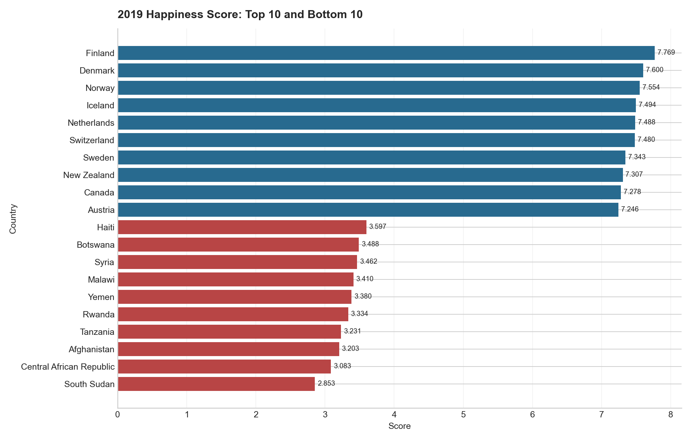
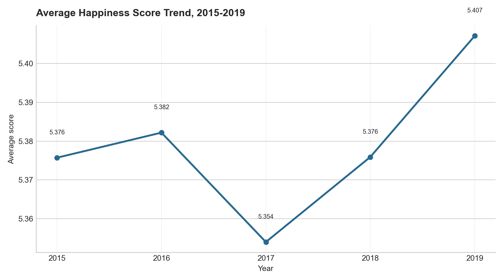
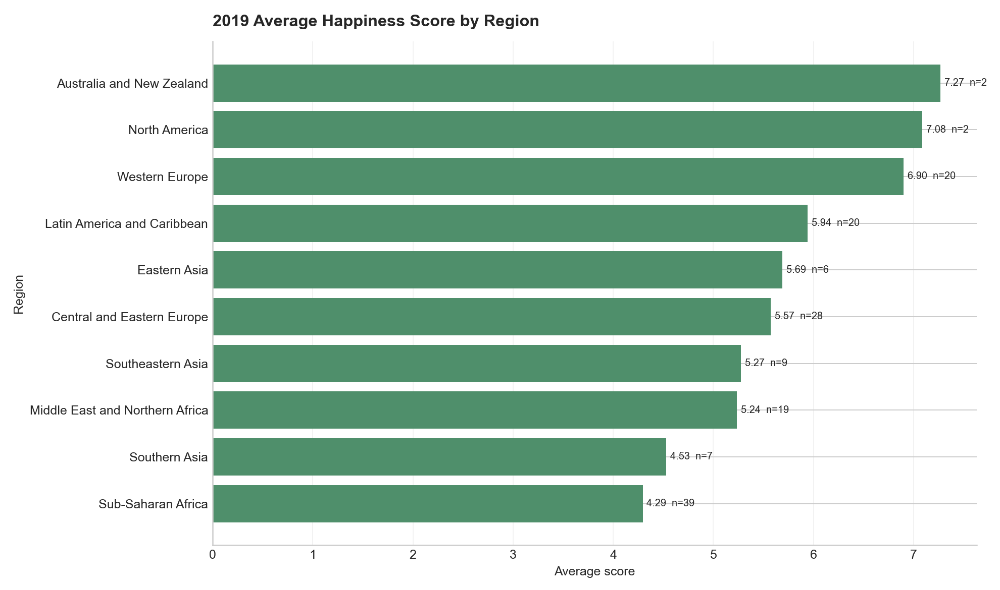
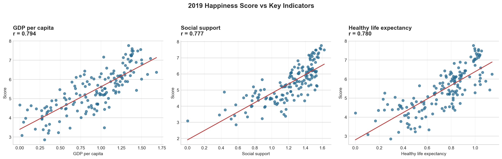

# data-analysis


[](https://www.codetriage.com/chenmi911/data-analysis)

该 repo 用来记录我的数据分析学习项目。当前整理了 World Happiness Report 和 Superstore 两个项目，重点记录从原始 CSV 到清洗表、SQL 分析、图表和结论的完整过程。

当前项目分工是：Python 负责数据读取、字段清洗、日期处理、异常检查和清洗表输出；MySQL 基于清洗后的标准表做经营指标、排名、趋势、分组、折扣影响和客户分层分析。

## wish

当前阶段，我主要用这个项目练习以下能力：

* 熟悉企业数据分析的基本工作流：取数、清洗、分析、可视化、结论输出。
* 理解不同业务场景的核心指标，例如销售额、利润率、转化率、留存率、库存周转、ROI。
* 提升 Python、pandas、MySQL、可视化和报告写作能力。
* 训练从“数据现象”到“业务解释”再到“行动建议”的分析思维。
* 积累可以展示给实习、校招或项目面试的作品集。

## tip

* 当前项目使用 Python、pandas、MySQL 和 matplotlib。
* 我保留了原始数据、清洗后数据、Python 脚本、MySQL 脚本、图表输出和过程说明。
* 项目重点不是堆方法，而是把数据清洗、指标口径、分析过程和结论边界讲清楚。
* CodeTriage 官方动态徽章需要仓库先被 CodeTriage 收录；当前可先使用顶部入口 badge，收录后替换为：

```text
[](https://www.codetriage.com/chenmi911/data-analysis)
```

> 数据分析项目最重要的不是“图多”，而是每一步都能回答一个明确问题：为什么要处理这个字段、为什么这样分组、这个图支撑什么结论、结论能不能落地。

## list

| 主题 | 处理方式 | 技术栈 | 项目入口 | 数据 |
|---|---|---|---|---|
| World Happiness Report 幸福指数分析 | Python 清洗脏数据 + MySQL 分析 + matplotlib 可视化 + 结论输出 | Python + pandas + MySQL + matplotlib | [项目说明](projects/world-happiness-report/README.md) / [代码讲解](projects/world-happiness-report/docs/code_walkthrough.md) / [MySQL 分析](projects/world-happiness-report/mysql/README.md) | [raw csv](projects/world-happiness-report/data/raw) |
| Superstore 零售经营分析 | pandas 清洗订单明细 + MySQL 经营分析 + RFM 客户分层 + 结论输出 | Python + pandas + MySQL + SQL 窗口函数 | [项目说明](projects/superstore-business-analysis/README.md) / [SQL 分析](projects/superstore-business-analysis/sql/superstore_mysql_analysis.sql) / [结论文档](projects/superstore-business-analysis/docs/superstore_findings.md) | [clean csv](projects/superstore-business-analysis/data/superstore_orders_clean.csv) |

## current project

### World Happiness Report 分析

业务场景：模拟咨询公司或国际业务部门的海外市场环境评估。分析目标不是做预测，而是回答：

* 哪些国家和地区幸福指数更高？
* 2015-2019 年哪些国家变化最明显？
* 地区之间是否存在明显差异？
* GDP、社会支持、健康预期寿命等指标与幸福分数的关系如何？
* 这些结果能为海外市场研究提供哪些参考？

学习文档：

* [项目说明与结论](projects/world-happiness-report/README.md)
* [分析过程说明](projects/world-happiness-report/docs/analysis_process.md)
* [Python 代码逐段讲解](projects/world-happiness-report/docs/code_walkthrough.md)
* [MySQL 分析记录](projects/world-happiness-report/mysql/README.md)

### Superstore 零售经营分析

业务场景：模拟零售电商经营分析，基于订单明细回答销售、利润、折扣、区域、品类和客户价值问题。

分析目标：

* 公司整体销售额、利润和利润率表现如何？
* 利润问题主要集中在哪些区域、品类和子品类？
* 高折扣是否导致亏损，哪些品类风险最高？
* 哪些客户贡献利润，哪些客户高消费但低利润？
* 如何用 RFM 将客户分为高价值、重点发展、流失风险等类型？

学习文档：

* [项目说明](projects/superstore-business-analysis/README.md)
* [MySQL 分析 SQL](projects/superstore-business-analysis/sql/superstore_mysql_analysis.sql)
* [经营分析结论](projects/superstore-business-analysis/docs/superstore_findings.md)

## preview

### 2019 年幸福指数 Top / Bottom



### 2015-2019 年平均幸福指数趋势



### 2019 年地区平均幸福指数



### 关键指标与幸福分数关系



## quick start

```powershell
pip install -r requirements.txt
python projects/world-happiness-report/run_all.py
```

运行后会重新生成：

* 清洗后的长表
* 数据质量检查表
* Top / Bottom 国家表
* 分数变化表
* 地区汇总表
* 相关性结果表
* 4 张可视化图表

Superstore 项目运行：

```powershell
python projects/superstore-business-analysis/src/analysis_superstore.py
mysql --local-infile=1 -uroot -p --execute="source projects/superstore-business-analysis/sql/superstore_mysql_analysis.sql"
```

## skills

`Python` `pandas` `matplotlib` `MySQL` `SQL` `EDA` `data cleaning` `data visualization` `business analytics` `portfolio project` `CSV analysis` `correlation analysis` `trend analysis` `retail analytics` `RFM analysis` `customer segmentation` `data storytelling`

## recommended topics

当前仓库使用的 GitHub About topics：

```text
python
pandas
matplotlib
mysql
sql
data-analysis
data-visualization
exploratory-data-analysis
business-analytics
analytics-portfolio
portfolio-project
world-happiness-report
superstore
retail-analytics
rfm-analysis
customer-segmentation
csv-analysis
data-cleaning
data-storytelling
beginner-friendly
open-data
```

## refer

> 1. [World Happiness Report](https://worldhappiness.report/)
> 2. [World Happiness Report dataset on Kaggle](https://www.kaggle.com/datasets/unsdsn/world-happiness)
> 3. [pandas documentation](https://pandas.pydata.org/docs/)
> 4. [matplotlib documentation](https://matplotlib.org/stable/)
> 5. [GitHub repository style reference: TurboWay/bigdata_analyse](https://github.com/TurboWay/bigdata_analyse)

## license

Code and documents in this repository are released under the MIT License. Raw datasets keep their original data source licenses and terms.
